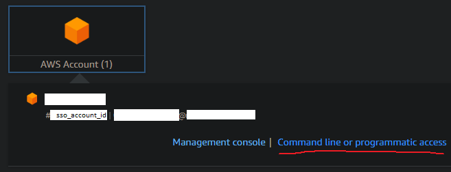
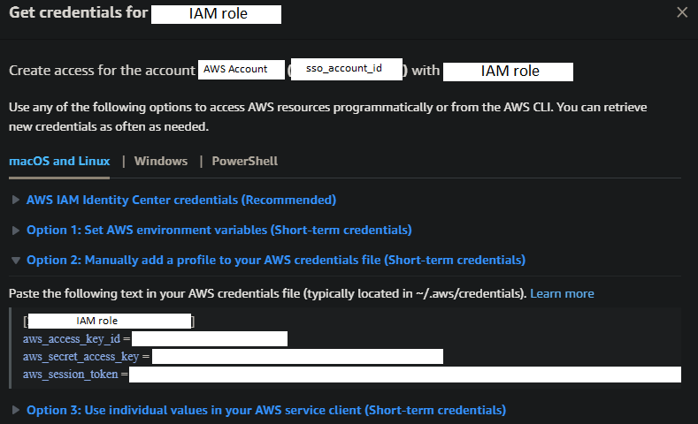

AWS CLI
=======

[Return to top README.md](../../../README.md)

# Docker Image

[link](https://hub.docker.com/r/amazon/aws-cli)

# Install AWS CLI

[AWS CLI getting started docs](https://docs.aws.amazon.com/cli/latest/userguide/cli-chap-getting-started.html)

verify installation with

```bash
aws --version
```

## `config` file

Use the aws [configure wizard](https://docs.aws.amazon.com/cli/latest/userguide/sso-configure-profile-token.html#sso-configure-profile-token-auto-sso) to setup the `config` file

```bash
aws configure sso
```

Another [guide](https://dev.to/slsbytheodo/understand-the-aws-sso-login-configuration-4am7)

You will be asked about SSO info; a name for the sso-session (your choice of name), start URL (the website you go to that produces the UI pictured below) region (I think it's the region of the AWS account), and registration scopes (this I have left blank and it autofills to `sso:account:access`).



With info entered, the terminal should automatically try to open the SSO authorization page in your browser. If successful you should see the terminal show you a code that matches what is shown in the browser, if so, click to grant access.

Next you will be asked about which AWS account to use and which role to use, so select accordingly. If you only have one account/role, they will be chosen automatically.

Next you will be asked about region, provide the region that correspond to the VPC you want to use (the region where the resources of interest are... I think). When asked about output format, you can leave it blank. Provide a CLI profile (what I will call a `config profile`) name when asked.

Running the wizard will create the folder

```bash
~/.aws
```

Additionally, the wizard will have populated this directory with a `config` file which contains the info you provided to `aws configure sso`. However, a `credentials `file has not yet been created. I have been able to `git clone` without needing to set up a `credentials` file.

[Docs](https://docs.aws.amazon.com/sdkref/latest/guide/file-location.html) on file location

## `credentials` file

To interact with AWS services (eg. pull data to local), you will need to set up a `credentials` file. To run the setup wizard, run

```bash
aws configure
```

The credentials info will be shown to us in the SSO page:


Click on "Command line or programmatic access"

"Option 2" let's you copy the necessary credentials information which can than me pasted into the `~/.aws/credentials` file



By default, `boto3` will use the default `credentials` profile. To use another profile, you have to point to it somehow, here are some [options](https://stackoverflow.com/questions/33378422/how-to-choose-an-aws-profile-when-using-boto3-to-connect-to-cloudfront)

# SSO Log In

To login

```bash
aws sso login
```

If you would like to use a particular profile, use the `--profile` option and provide whatever CLI profile name you'd like to use

To know which profile you are using, run

```bash
aws sts get-caller-identity
```

There is also

```bash
aws configure list
```

There is also

```bash
aws configure list-profiles
```

# CodeCommit

After installing `git`, install `git-remote-codecommit`

[Guide](https://docs.aws.amazon.com/codecommit/latest/userguide/setting-up-git-remote-codecommit.html)

```bash
pip install git-remote-codecommit
```

In WSL this did not work so I uninstalled and then installed with `sudo`

```shell
pip uninstall git-remote-codecommit
sudo pip uninstall git-remote-codecommit
```

To clone from CodeCommit, be sure to have been logged into SSO and now try

```bash
git clone codecommit::<region>://<config profile>@<repo name>
```

which will thus require the corresponding `<config profile>` to be defined within `config`. Be sure that the config profile I want to use has `region` set to the region of the code repo I want to clone, or

```bash
git clone codecommit::<region>://<repo name>
```

which I think uses the default AWS config profile, so just means that the default profile has to have all the info needed

# `boto3`

When accessing resources via `boto3`, credentials are needed. [Here](https://boto3.amazonaws.com/v1/documentation/api/latest/guide/credentials.html) is how `boto3` determines which credentials profile is used. [Here ](https://stackoverflow.com/questions/33378422/how-to-choose-an-aws-profile-when-using-boto3-to-connect-to-cloudfront)are some code examples of setting the profile, note that some of these answers have outdated syntax.

2024-01-12 I onboarded someone to AWS and they were able to use `boto3` to pull data from S3 without having to set up credentials. I suspect it depends on how the AWS account was set up.

# Summary

Currently I have three places of interest where a "profile" needs to be specified.

* `aws sso login --profile <config profile>`
* `git clone codecommit::<region>://<config profile>@<repo name>`
* `boto3.setup_default_session(profile_name=<credentials profile>)`

The last one is used in code to interact with AWS services. When code is deployed on AWS, I am not sure how profiles are handled, or if they are even needed...

TBD: what profiles are needed to push to CodeCommit? Can I push without `credentials` set up?
