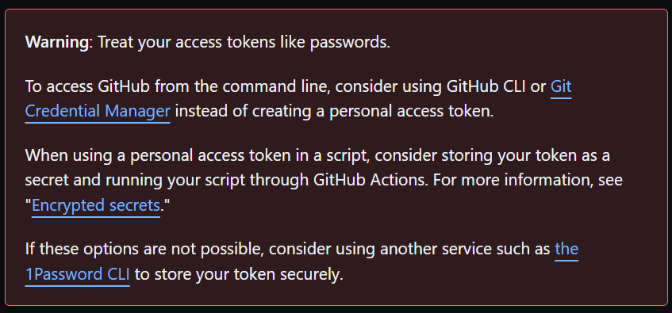
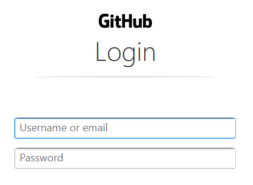
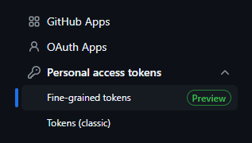
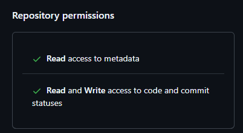
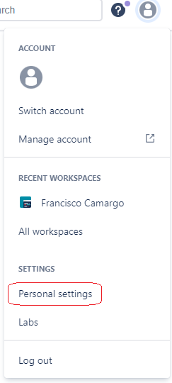

# git

[Return to top README.md](../../README.md)

To view the remote repo URL, run
`cat .git/config`

## git credentials

[Guide](https://support.atlassian.com/bitbucket-cloud/docs/configure-your-dvcs-username-for-commits/) on `git` credentials

To set credentials specific to the current repo, run

```bash
git config user.name "name"
git config user.email "email@email.com"
```

To set global credentials, run

```bash
git config --global user.name "name"
git config --global user.email "email@email.com"
```

## GitHub HTTPS Credentials

Here are the credentials I use when working with a personal GitHub repo.

For the username I will use the GitHub "noreply" email (because... something about hiding my email) which can be found in personal settings on GitHub, [guide](https://stackoverflow.com/a/51097104/9205210).

For the password use a personal access token (PAT). It seems that in order to make use of it I need to clone the repo using HTTPS. Will create one PAT per computer.

[Guide](https://docs.github.com/en/enterprise-server@3.4/authentication/keeping-your-account-and-data-secure/creating-a-personal-access-token) on how to create a PAT. At the top of the guide there are some valuable warnings, including one on using encrypted secrets; not storing sensitive info in repos.



### Trying it

When I do `git push` on a new machine I get the following pop-up:



I tried using my noreply email and PAT, but that did not work and instead the CLI prompted me to enter my username. I used my noreply email and got a pop-up asking for my password. I used a new PAT (created in the moment for the machine I am using), and I was able to successfully push to the remote repo.

Using this method of entering my credentials, I did not have to enter my credentials in subsequent `git push` commands!

2023-01-20

made a new PAT (previous one had expired). I get to the pop-up window (seen above), and I was able to connect via a  `git bash` terminal within VSCode by logging-in with my github email (not the no-reply one) and used my new PAT as the password

However if this is a problem. I don't want to have to enter my username and password (PAT) every time, so follow this [guide](https://www.freecodecamp.org/news/how-to-fix-git-always-asking-for-user-credentials/) or maybe [this](https://www.techiediaries.com/git/stop-git-always-asking-for-username-and-password-when-using-https/) guide and essentially run the following commands (at the moment, not sure that I've gotten any of this to work...):

```bash
git config --global credential.helper store
git config --global credential.helper cache
```

2024-01-07

Trying to use GitHub on new machine, could not get a new PAT to work so will switch to using SSH... I tried `git push` on a repo that had been using HTTPS using `git bash` within VSCode. I got the pop-up to log in to GitHub, I canceled and was asked if I wanted to let the VSCode GitHub extension have access to my GitHub account. I clicked yes, it sent me to the browser where I verified that I wanted to grant permissions... and that worked! I was able to `git push` to GitHub even though I did not log-in when prompted in the terminal.

2025-03-13

One machine started asking for credentials whenever I wanted to work locally. I suspect that the PAT ran out. To get to the PAT page on the GitHub website, go to Settings, then Developer settings. Now look for Fine-grained tokens,



 I deleted the old PAT on GitHub and created a new one with the following settings



Now I tried to clone the repo of interest, was asked for credentials and use my username and the PAT as the password. Still have to do this twice for some reason...

## SSH

### [Generate a new SSH key](https://docs.github.com/en/authentication/connecting-to-github-with-ssh/generating-a-new-ssh-key-and-adding-it-to-the-ssh-agent#generating-a-new-ssh-key)

I entered in my GitHub email (should try with no-reply email). When asked about filename and passphrase, I just left those fields blank. If successful you will end up with a public key, `~/.ssh/id_ed25519.pub`, and a private key, `~/.ssh/id_ed25519`

### [Auto-launching ssh-agent on Git for Windows](https://docs.github.com/en/authentication/connecting-to-github-with-ssh/working-with-ssh-key-passphrases#auto-launching-ssh-agent-on-git-for-windows)

Add the provided code from the link to `~/.bashrc`

```bash
env=~/.ssh/agent.env

agent_load_env () { test -f "$env" && . "$env" >| /dev/null ; }

agent_start () {
    (umask 077; ssh-agent >| "$env")
    . "$env" >| /dev/null ; }

agent_load_env

# agent_run_state: 0=agent running w/ key; 1=agent w/o key; 2=agent not running
agent_run_state=$(ssh-add -l >| /dev/null 2>&1; echo $?)

if [ ! "$SSH_AUTH_SOCK" ] || [ $agent_run_state = 2 ]; then
    agent_start
    ssh-add
elif [ "$SSH_AUTH_SOCK" ] && [ $agent_run_state = 1 ]; then
    ssh-add
fi

unset env
```

I did not have a `~/.bashrc` file so I made one and all it contains is the code from the link above. Open up a new `git bash` terminal. I got a warning about `~/.profile` not existing but it created one. I closed and re-opened `git bash` and it seemed happy.

### Configure SSH agent

Need to provide SSH agent access to private key, however, the default location where the generated key should have been made, `~/.ssh`, is accessible right away to the `ssh-agent` without us having to do anything.

### Provide GitHub the public SSH key

Within GitHub go to settings and then "SSH and GPG keys". Click "New SSH key", give it a name, and in the Key field paste in the ***public*** key value. Similar page should be found for BitBucket, or any other repo site.

### Clone repo via SSH

If it is all working, use `git clone` using the SSH address provided to you by GitHub.

## BitBucket Credentials

Using a personal BitBucket account use the Username found within the "Account Settings" page of BitBucket, found within the "Personal settings" page which can be accessed by clicking on the profile icon in the top left.



For the password, use an [App password](https://support.atlassian.com/bitbucket-cloud/docs/create-an-app-password/) which you can do from the "App passwords" page within "Personal settings".

### Transfer Repo from BitBucket to GitHub

[Guide](https://docs.github.com/en/migrations/importing-source-code/using-github-importer/importing-a-repository-with-github-importer) from GitHub. However, when you are asked to login with your BitBucket credentials within the GitHub website, use your BitBucket [username ](https://bitbucket.org/account/settings/)and [app-password](https://bitbucket.org/account/settings/app-passwords/), [link](https://gist.github.com/mandiwise/5954bbb2e95c011885ff?permalink_comment_id=3756611#gistcomment-3756611). [Guide ](https://support.atlassian.com/bitbucket-cloud/docs/create-an-app-password/)to generating a BitBucket app-password.

## git commands

### git diff

View of unstaged changes

```bash
git diff [filepath]
```

View staged changes

```bash
git diff --cached [filepath]
```

### Change commit message

To change the message of the last commit

```bash
git commit --amend
```

### git squash

[Guide](https://www.git-tower.com/learn/git/faq/git-squash) to using `rebase` to squash commits together. With several commits made, we can combine them into a single commit using `rebase`. For example, let's squash together the last 3 commits by running

```bash
git rebase -i HEAD~3
```

This will bring up a text editor where we choose what to do with the last 3 commits. In this case we want to `pick` or `p` the oldest commit (which will be the top one) and `squash` or `s` all the rest. Once we save this, we will be asked to provide a comment for the new commit. The text that given to start with will contain all the comments from the commits that are getting combined. Whatever remains as uncommented will be used as the commit message.

The part I don't like about this is that I have to squash commits that are local, if any of the squash commits have been pushed  to the remote repo, this won't work. If there was a way to squash commits in the remote repo I'd be able to totally clean things up, but then again, it may be for the best that the history in the remote repo can't so easily be rewritten.

The guide also describes how to "squash and merge" during pull requests in GitHub. I used this but I don't like it because after using this merge option the Network doesn't indicate that a merge was done: the branches in the network remain separate.

### git time machine

https://stackoverflow.com/questions/40253526/get-changes-from-another-branch-without-affecting-current-branch-at-all

https://stackoverflow.com/questions/5340724/get-changes-from-master-into-branch-in-git

https://stackoverflow.com/questions/4114095/how-do-i-revert-a-git-repository-to-a-previous-commit

Create branch using old commit, [link](https://stackoverflow.com/questions/8483983/how-to-create-the-branch-from-a-specific-commit-in-a-different-branch).

```bash
git checkout -b <new-branch-name> <commit id>
```

[View](https://stackoverflow.com/a/49838096/9205210) difference between two commits on GitHub

```bash
github.com/<username>/<repo_name>/compare/<commit1>...<commit2>
```

eg.

```bash
github.com/francisco-camargo/vidly/compare/04f5f58...e892d14
```

## Git End-of-Line handling

By default, when committing changes, `git` converts end-of-line characters depending on the OS. For example, if on a Windows machines, EOL will be changed to CRLF. [Here](https://betterstack.com/community/questions/git-replacing-lf-with-crlf/) is a guide on how to change this `git` setting locally.

[Here](https://docs.github.com/en/get-started/getting-started-with-git/configuring-git-to-handle-line-endings) is a guide on how to make these changes stick to the repo. I have a working example of a `.gitattributes` file in this repo. [Discussion](https://stackoverflow.com/questions/73573683/editing-gitattributes-to-normalize-line-endings-doesnt-work), [docs](https://git-scm.com/docs/gitattributes), [origin of .gitattributes](https://github.com/gitattributes/gitattributes/blob/master/.gitattributes), [working with .gitignore](https://stackoverflow.com/questions/18331048/how-to-create-a-git-attributes-file).
