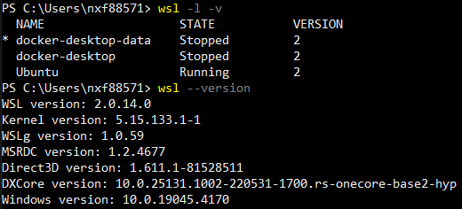
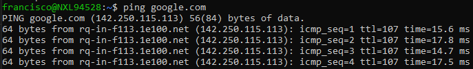

# Linux

[Return to top README.md](../../README.md)

## Shell commands

* Make a directory: `mkdir [directoryname]`
* New file: `touch [filename.extension]`
* Check contents of file (?): `cat [filepath]`

### Terminal Shortcuts

* New terminal tab: **ctrl+shift+t**
* New terminal window: **ctrl+alt+t**
* Switch to a specific tab: **alt+[tab #]**
* Close current tab (or window): **ctrl+shift+w**
* Copy: **ctrl+shift+c**
* Paste: **ctrl+shift+v**
* But how to I highlight text? What to do the equivalent of the Windows **ctrl+shift**+[arrow]

## WSL

[Check](https://www.zdnet.com/article/windows-10-tip-find-out-if-your-pc-can-run-hyper-v/) if your PC can run Hyper-V

[Guide](https://www.omgubuntu.co.uk/how-to-install-wsl2-on-windows-10)

### Install Ubuntu in WSL

Go to the Microsoft Store and install Ubuntu 20.04 (or whatever version you want).

From Windows, check what has been installed with

```shell
wsl --version
wsl -l -v
```



Within WSL, update `apt` with

```shell
sudo apt update && sudo apt upgrade
```

`git` should already be installed, if not you can install it with

```shell
sudo apt-get install git
```

### Check for internet connection

To check if WSL has internet access:

From within WSL run

```shell
ping google.com
```



Terminate the command with `ctrl+c`

If you do not have internet access, be sure you are on the correct network (via VPN), if needed. Alternativly, you may need to modify the `resolv.conf` file. This [thread](https://stackoverflow.com/q/62314789/9205210) describes how to do this. For some reason this gets undone on its own, so you may have to redo this again.

### Where is this repo once it is cloned?

Where is this repo in my local? I can get to it from the Ubuntu terminal using
`cd dev_workflow`
or
`cd /home/francisco/dev_workflow`
In Windows I can find it at
`\\wsl$\Ubuntu-20.04\home\francisco\dev_workflow`
