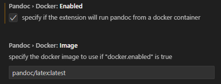
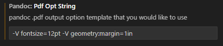
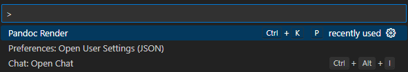
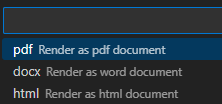

# Markdown

[Return to top README.md](../../README.md)

## Markdown Linting

We cam control markdown linting with a `.markdownlint.yaml` file in conjunction with the `markdownlint` VS Code extension. An example of such a file is included in this directory.

To use this configuration:
- Install the `markdownlint` extension in VS Code
- The `.markdownlint.yaml` file will be automatically detected and applied to markdown files in this directory
- You can also run `markdownlint` from the command line with `npx markdownlint *.md` to check files manually

## Code Blocks

Formatting code block [guide](https://docs.github.com/en/get-started/writing-on-github/working-with-advanced-formatting/creating-and-highlighting-code-blocks), [list](https://github.com/github/linguist/blob/master/lib/linguist/languages.yml)of available tags

Some useful tags:

|                    |                  |             |
| :----------------- | :--------------- | :---------- |
| Batchfile          | Jupyter Notebook | R           |
| BibTeX             | Makefile         | bash        |
| Click              | Markdown         | SQL         |
| CSV                | Numpy            | TeX         |
| Dockerfile         | Pickle           | Text        |
| GraphQL            | PowerShell       | TOML        |
| Ignore List        | Python           | Vim Snippet |
| JSON               | Python console   | XML         |
| JSON with Comments | Python traceback | YAML        |

<!--
* bash, recommended
* Batchfile
* BibTeX
* Click
* CSV
* Dockerfile
* GraphQL
* Ignore List
* JSON
* JSON with Comments
* Jupyter Notebook
* Makefile
* Markdown
* Numpy
* Pickle
* PowerShell
* Python
* Python console
* Python traceback
* R
* Shell, not recommended
* SQL
* TeX
* Text
* TOML
* Vim Snippet
* XML
* YAML
-->

## LaTeX equation formatting for Markdown

In a Markdown file, the following syntax

```TeX
$y=mx+b$
```

displays as
$y=mx+b$

## YAML Header

[Guide](https://zsmith27.github.io/rmarkdown_crash-course/lesson-4-yaml-headers.html)

## dillinger.io

[dillinger.io](https://dillinger.io/) is an easy option to convert markdown to pdf. However, have to copy paste into the web-browser.

However, would have to figure out how to customize as needed (e.g. add page numbers, add page breaks)

## Pandoc

[Pandoc](https://pandoc.org/) is a document converter. I have been using it to convert from `.md` to `.pdf`. Specifically, I have been using the VSCode extension `vscode-pandoc`.

Additionally, here the setting I use:

### Docker



### PDF Options

Here I have changed the output font size and margin spacing.q

```bach
-V fontsize=12pt -V geometry:margin=1in
```



### Running Pandoc

While viewing the `.md` file of interest, open the Command Palette (`ctrl + shift + p`) and look for and select `Pandoc Render`



You will then have some options of the output format, we will use pdf



If successful, this will run a Docker container and produce a pdf.

## Markdeep

[Markdeep](https://casual-effects.com/markdeep/). Seems to have example `.md.html` files that have decent styling and can be opened via a browser. Maybe been good for making webpages. Not clear if there is a way to then also convert to `.pdf`.
