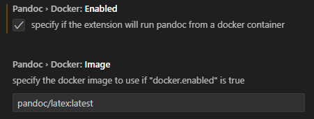
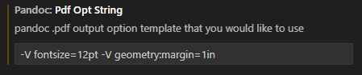
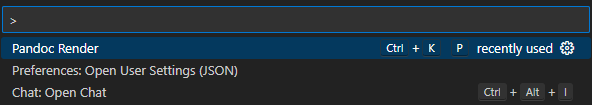
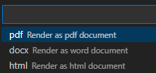

# Markdown

[Return to top README.md](../../README.md)

## Markdown linting

markdownlint checks Markdown files against a set of rules, and fixes the ones it can.
Every repo built from [repo-template](https://github.com/francisco-camargo/repo-template) runs it in the editor and at commit, from one config file.

### How the pieces fit

- **`.markdownlint.yaml`** at the repo root holds the rules: markdownlint's defaults, with the changes listed in [repo-template's README](https://github.com/francisco-camargo/repo-template#markdown-linting).
- **The pre-commit hook**, `markdownlint-cli2` in `.pre-commit-config.yaml`, lints the Markdown files in each commit. It runs with `--fix`, so it fixes what it can and fails the commit, leaving the fixes for you to review and stage. Anything it cannot fix fails the commit with the file, line, and rule.
- **The VS Code extension**, [markdownlint](https://marketplace.visualstudio.com/items?itemName=DavidAnson.vscode-markdownlint), reads the same file and underlines problems as you type. The user setting `"source.fixAll.markdownlint": "explicit"` under `editor.codeActionsOnSave` applies its fixes on save.
- **`~/.markdownlint.yaml`** holds the rules for a repo without a config of its own. The user setting `"markdownlint.configFile": "${userHome}/.markdownlint.yaml"` points the extension at it. A repo's own file takes precedence.

The hook and the extension both find a config by looking in the linted file's folder, then each folder above it.
A config outside that path goes unread, and markdownlint falls back to its defaults, which fail every long line.

### Setting up a new repo

1. Copy repo-template's `template/` into the repo, as its README describes. That brings `.markdownlint.yaml`, `.pre-commit-config.yaml`, and `.editorconfig`.
2. Run `pre-commit install`.
3. Run `pre-commit run markdownlint-cli2 --all-files`, review what it fixed, fix the rest by hand, and commit.

The hook's first run downloads Node if Node is not installed.

To change a rule for every repo, change repo-template's `.markdownlint.yaml` and copy it into each repo.
To change one for a single repo, edit that repo's copy.

### Indents

Pressing Tab in a Markdown file inserts 4 spaces: `.editorconfig` sets `indent_size = 4` for `*.md`, and the VS Code user settings set `editor.tabSize` to 4.
MD007 expects the same 4 spaces for a nested list, and the hook rewrites a 2-space one.

### What markdownlint cannot check

markdownlint checks Markdown syntax, not prose.
One sentence per line, em dashes, and wording need a prose linter, which dotfiles' [Check prose with Vale](https://github.com/francisco-camargo/dotfiles/blob/main/TODO.md#check-prose-with-vale) plans.

## Code Blocks

Formatting code block [guide](https://docs.github.com/en/get-started/writing-on-github/working-with-advanced-formatting/creating-and-highlighting-code-blocks), [list](https://github.com/github/linguist/blob/master/lib/linguist/languages.yml)of available tags

Some useful tags:

|                    |                  |             |
| :----------------- | :--------------- | :---------- |
| Batchfile          | Jupyter Notebook | R           |
| BibTeX             | Makefile         | bash        |
| Click              | Markdown         | SQL         |
| CSV                | Numpy            | TeX         |
| Dockerfile         | Pickle           | Text        |
| GraphQL            | PowerShell       | TOML        |
| Ignore List        | Python           | Vim Snippet |
| JSON               | Python console   | XML         |
| JSON with Comments | Python traceback | YAML        |

<!--
* bash, recommended
* Batchfile
* BibTeX
* Click
* CSV
* Dockerfile
* GraphQL
* Ignore List
* JSON
* JSON with Comments
* Jupyter Notebook
* Makefile
* Markdown
* Numpy
* Pickle
* PowerShell
* Python
* Python console
* Python traceback
* R
* Shell, not recommended
* SQL
* TeX
* Text
* TOML
* Vim Snippet
* XML
* YAML
-->

## LaTeX equation formatting for Markdown

In a Markdown file, the following syntax

```TeX
$y=mx+b$
```

displays as
$y=mx+b$

## YAML Header

[Guide](https://zsmith27.github.io/rmarkdown_crash-course/lesson-4-yaml-headers.html)

## dillinger.io

[dillinger.io](https://dillinger.io/) is an easy option to convert markdown to pdf. However, have to copy paste into the web-browser.

However, would have to figure out how to customize as needed (e.g. add page numbers, add page breaks)

## Pandoc

[Pandoc](https://pandoc.org/) is a document converter. I have been using it to convert from `.md` to `.pdf`. Specifically, I have been using the VSCode extension `vscode-pandoc`.

Additionally, here the setting I use:

### Docker



### PDF Options

Here I have changed the output font size and margin spacing.

```bach
-V fontsize=12pt -V geometry:margin=1in -V colorlinks=true -V linkcolor=blue -V urlcolor=blue -V toccolor=gray
```



### Running Pandoc

**_While viewing the `.md` file of interest_**, open the Command Palette (`ctrl + shift + p`) and look for and select `Pandoc Render`



You will then have some options of the output format, we will use pdf



If successful, this will run a Docker container and produce a pdf.

## Markdeep

[Markdeep](https://casual-effects.com/markdeep/). Seems to have example `.md.html` files that have decent styling and can be opened via a browser. Maybe been good for making webpages. Not clear if there is a way to then also convert to `.pdf`.
