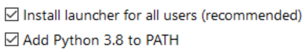
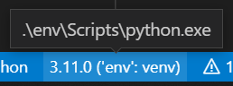
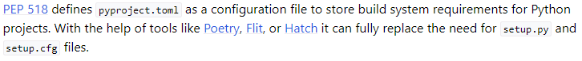

Python
======

[Return to top README.md](../../README.md)

# Install Python on Windows

[Link](https://www.python.org/downloads/) to download Python.

During installation, be sure to add Python to PATH:



Check the version of Python. Note that it can have different aliases, e.g. `python`, `py`, `python3` etc.

```bash
python --version
>>> Python3.11.0
```

If you use VSCode, be sure that the desired Python Interpreter is used: from the Command Pallette search for `Python: Select Interpreter`. Can check the bottom right of the window:


# Install Python on WSL

[Guide](https://computingforgeeks.com/how-to-install-python-on-ubuntu-linux-system/)

give an [alias](https://askubuntu.com/questions/320996/how-to-make-python-program-command-execute-python-3?newreg=a3ae2d11b44641baba3120c0f6ca6111)

`alias python = python3.10`

[Guide](https://stackoverflow.com/questions/63591163/python3-pip-has-no-installation-candidate) to install `pip`

```shell
sudo apt-get update
sudo apt-get upgrade # not needed according to guide, but may as well
sudo apt install python3-pip
```

# Python Code Environment

Download and install Python from [link](https://www.python.org/downloads/)

To create an environment via the terminal, use

`python -m venv env`

On Ubuntu, you may need to install `python3-venv`, [link](https://askubuntu.com/questions/1328392/how-to-activate-a-virtual-environment-in-ubuntu)

`sudo apt install python3-venv`

To activate environment in Windows, use

`env/Scripts/activate`

In `git bash` may have to use `. env/Scripts/activate`

In Ubuntu use

`env/bin/activate`

To update `pip`, use

`python -m pip install --upgrade pip`

To install libraries, use

`pip install -r requirements.txt`

To deactivate an active environment, use

`deactivate`

# Importing local code from other directories

Assume you have the following folder structure:

```shell
parent
  scriptE.py
  folder1
    scriptA.py
    scriptB.py
    folder3
      scriptF.py
  folder2
    scriptC.py
    scriptD.py
```

and the current working directory is `folder1`.

If you need to run from a submodule directly such that `__name__` is `'__main__'`, try adding the parent directory to the system path
```python
try:
    from folder1.folder3 import scriptF
except ModuleNotFoundError as e:
    sys.path.append(os.getcwd())
    from folder1.folder3 import scriptF
```

If you want to do relative imports: good [write-up](https://stackoverflow.com/questions/14132789/relative-imports-for-the-billionth-time). My current understanding is that whatever script is `'__main__'` will not be able to utilize relative imports!

Again assume the current working directory is `folder1`:
* For `scriptB.py`, use `import scriptB`
* For `scriptF.py`, use `import folder3.scriptF`
* For `scriptE.py`, you _must_ use the `from` syntax; `from ..scriptE import *`
* For `scriptC.py`, use `from ..folder2.scriptC`

Here are some useful commands to help debug some of these issues:

```python
    import sys
    print(f'system path: {sys.path}')
    import os
    print(f'current working dir (cwd): {os.getcwd()}')
    print(f'ls within cwd: {os.listdir('./')}')
    print(f'ls within ../cwd: {os.listdir('../')}')
```

# Running Python code in VSCode

To use the IPython terminal, install IPython

```bash
pip install ipython
```

Then in the VSCode terminal run

```bash
ipython
```

need to load (once) the `%autoreload` extension, [guide](https://ipython.readthedocs.io/en/stable/config/extensions/autoreload.html),

```Python
%load_ext autoreload
```

now can use `%autoreload`

```Python
%autoreload
%run main.py
```

I was able to run both of these lines together in the VSCode terminal by using **Ctrl+o** in the terminal to have multiple lines of input.

This will have the same effect as clicking **Run** within Spyder on whatever Python file Spyder has open. This also has the benefit of seeing changes to the code while still in IPython, which is not working when using the "import main" approach.

(old) and then within the IPython terminal that has now been instantiated, import the module you want to use

```Python
import main; main.main()
```

# `pyproject.toml`

The [documentation](https://black.readthedocs.io/en/stable/usage_and_configuration/the_basics.html) for `black` suggests that we can use a `pyproject.toml` file to replace both `setup.py` and `setup.cfg` files.



# Packaging

Learn how to package code, there are several options, so first want to just look at all of them before picking one to run with

[Guide](https://stackoverflow.com/questions/1471994/what-is-setup-py)

[Guide](https://packaging.python.org/en/latest/guides/distributing-packages-using-setuptools/#configuring-your-project)

[Guide](https://godatadriven.com/blog/a-practical-guide-to-using-setup-py/), in it, they say: nowadays the use of setup.py is discouraged in favour of pyproject.toml together with setup.cfg. Find out how to use those [here](https://godatadriven.com/blog/a-practical-guide-to-setuptools-and-pyproject-toml/).

Poetry also does a similar thin? There may be some [serious problems](https://www.youtube.com/watch?v=Gr9o8MW_pb0) with Poetry. [webpage](https://python-poetry.org/) Sounds like poetry also does dependance management, so maybe use it instead of `venv`? [Poetry intro](https://youtu.be/0f3moPe_bhk) from ArjanCodes, who seems happy with it. Sounds like it can help with package publishing.

What the heck is a wheel?

# Plotting

I can plot out-of-the box to a pop-up window in VSCode if I use Run, but if I use ipython to run the code, I can't seem to be able to get the plots.

In `./src/plotting.py` I placed sample code for a plotting function that handles the aesthetics well. It Accounts for; uncertainty bands, `.eps` formatting, size of plot for two column paper, and several other minor details.

# Data Validation

[Pydantic](https://www.youtube.com/watch?v=zN4VCb0LbQI)

# Pandas

## Data Types for DataFrames

[Guide](https://youtu.be/-tU7fuUiq7w)

[Guide](https://towardsdatascience.com/validate-your-pandas-dataframe-with-pandera-2995910e564)

## `df.apply()`

[df.apply()](https://www.geeksforgeeks.org/apply-function-to-every-row-in-a-pandas-dataframe/)

## `SettingWithCopyWarning`

[Guide](https://realpython.com/pandas-settingwithcopywarning/), simple explanation on how to deal with this. First line of defence: use `.loc` and `.iloc`

```Python
df.loc[idx_label, col_label] = some_new_value
```

I think `idx_label` then just needs to be an element found within `df.index()`.

Alternatively, you could use a mask. By example:

```Python
mask = df[column_label]==some_value
```

This returns a mask of boolean values to pick out rows. Now use this mask instead of `idx_label`

```Python
df.loc[mask, col_label] = some_new_value
```

# SciKit-Learn

Want to be able to use sklearn without having to switch back and forth between numpy arrays and dataframes. Use [sklearn-pandas](https://github.com/scikit-learn-contrib/sklearn-pandas). I have successfully used this in `make_features.py` within the `dsc_roadmap` project; import `DataFrameMapper` and use it in conjunction with the sklearn `SimpleImputer`.

## ShuffleSplit

[StackOverflow](https://stackoverflow.com/questions/34731421/whats-the-difference-between-kfold-and-shufflesplit-cv#:~:text=As%20your%20data%20set%20grows,ShuffleSplit%20is%20an%20attractive%20option.) on why ShuffleSplit is useful as training data size grows

# Experimental Setup

[Guide](https://hydra.cc/docs/intro/) into how to use Hydra to help run experiments using Python.

[Video](https://youtu.be/tEsPyYnzt8s) intro

[Video](https://www.youtube.com/watch?v=bNGu8A6F3-8) mentions integration with mlflow around 20min mark, talks about parallelization (26min mark)

[Video](https://www.youtube.com/watch?v=3gk9CvMOdzE) for hydra-zen

# Model based testing

There is the `hypothesis` python package. [Docs](https://hypothesis.readthedocs.io/en/latest/), [demonstration](https://youtu.be/-S3BFkNn0rQ)
