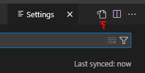
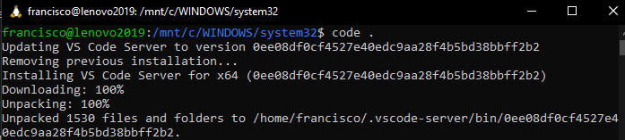
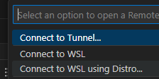
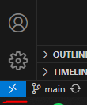
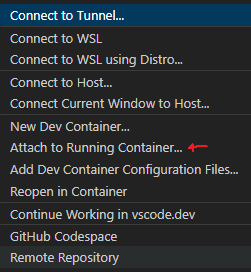
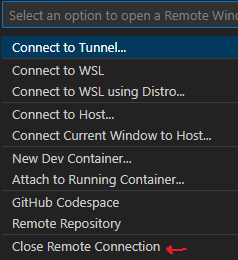
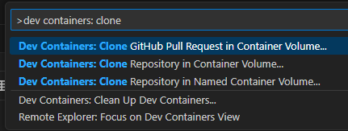

VSCode
======

[Return to top README.md](../../README.md)

Using Sync via my personal GitHub account to sync my VSCode settings across machines.

I use the **Dark+** color theme.

# Open Settings

Open up the command pallette (**Ctrl+Shift+p**) and then choose from:

* `Preferences: Open Keyboard Shortcuts`
* `Preferences: Open Settings (UI)`
  * To then open up `settings.json` look for the `Open Settings (JSON)` button in the top right:

# VSCode Shortcuts

[Reference](https://code.visualstudio.com/shortcuts/keyboard-shortcuts-windows.pdf) of VSCode shortcuts

Command palette
**Ctrl+Shift+p**

Open file
**Ctrl+p**

Tab windows: VSCode tabs can put placed into vertical slots. To place the current tab into a certain slot, use **Ctrl+Alt+#** where **#** can be 1, 2, etc. To switch **between** tabs within the same slot, use **Ctrl+Tab**. To switch between tabs, use **Ctrl+#**.

Switch between terminal and editor:
**Ctrl+`**

Debug console:
**Ctrl+Shift+y**

In the Settings page, look for Line Number; I like to use relative line numbers because it makes it easier to navigate with Vim.

# Using VSCode Remotely

[Guide](https://medium.com/@christyjacob4/using-vscode-remotely-on-an-ec2-instance-7822c4032cff)

# Install VSCode for WSL

[Guide](https://code.visualstudio.com/docs/remote/wsl): install  VSCode in the Windows side.

In the Ubuntu terminal, go to the folder in which we want to work and start-up VSCode:

`code .`

May need to be on appropriate network so may need to use VPN.

There is some first-time automatic set-up but once VSCode is open, at the bottom left I see that in green it says `WSL: Ubuntu-20.04`

Alternatively, from within VSCode on Windows side, hit the blue "Open a Remote Window" button and then select "Connect to WSL". If that doesn't work (because a docker distribution is set to default), try "Connect to WSL using Distro..." which will allow you to directly choose the Ubuntu distribution.

If you get the error `ERROR: cannot verify update.code.visualstudio.com's certificate` when trying to open VSCode via `code .`, open VSCode from Windows and connect to WSL from inside VSCode. If that worked, close VSCode from Windows, and try to open it again from WSL via `code .`, [link](https://stackoverflow.com/a/76841961/9205210).

# Docker Dev Environment

Open the remote VSCode window (bottom right)

Select to attach to running container

Install the `Python` VSCode extension. This will be installed in this container so as long as this container persists you won't have to reinstall this extension again. This extension will allow VSCode to find variable definitions (can use `F12`). If this does not work right away, close and re-connect VSCode.

To close this instance, click the blue button in the bottom-right and select to close remote connection

Additionally, you may get some warnings regarding the `Python` extension, these should be resolved with restarting.

Changes in this containarized instance of VSCode will be reflected in the host machine.

Some [info](https://github.com/patrickloeber/python-docker-tutorial/tree/main/dev-environment#7-debug-python-code-inside-a-container) on debugging

## Dev Containers

TLDR: I don't love dev containers

Following [this](https://youtu.be/SDa3v4Quj7Y?si=d_Xm9Kh_TnlIWXoJ) video guide

Install the Remote Development extension pack, which includes Dev Containers. Let's use the "Clone Repoository in Container Volume..." option.

## Delayed `--reload`

Due to the delayed `--reload` (see subsection below), it's worth it to *clone the repo within WSL* and launch `docker-compose` from there, instead of directly from Windows. This will remove delay observed between making a change is made to the code and seeing the change take effect in the web application!

I have noticed that when a change is made to the code in the host machine, it takes several seconds before the change is picked up by the containerized instance of `uvicorn` when using the `--reload` flag. [This](https://youtu.be/SDa3v4Quj7Y?si=IauV72FmPa4kyS8r&t=384) video explains a possible reason why. The solution is to clone repos directly into WSL.
